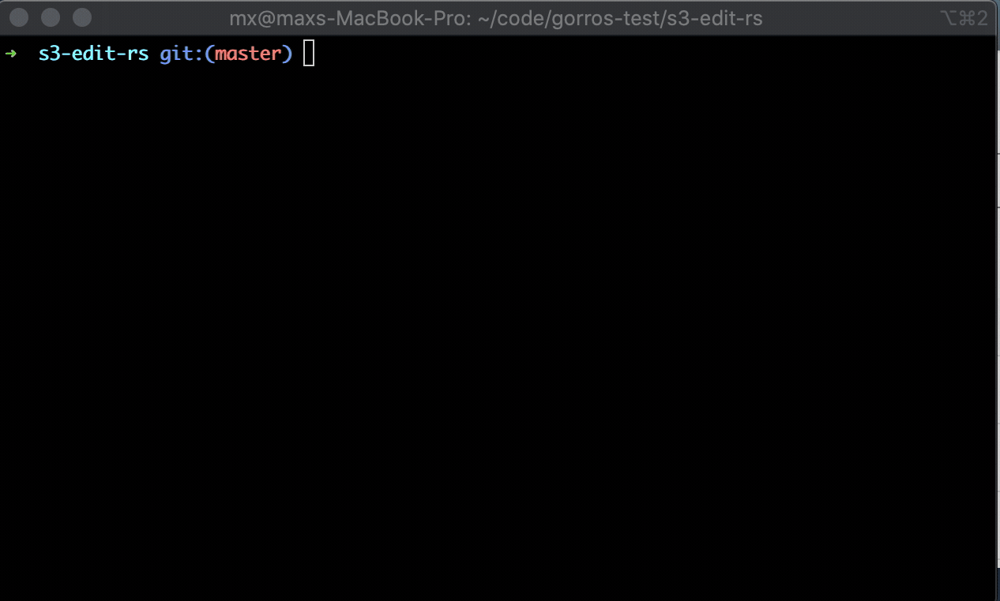

# s3-edit-rs
The original idea for this project comes from  [s3-edit](https://github.com/tsub/s3-edit) written in Go by [tsub](https://github.com/tsub). I started this project for educational purposes, and it is my first project written in Rust.

## Intallation
### Install with cargo
```
$ cargo install --git https://github.com/gorros/s3-edit-rs
```

## Requirements

- AWS credentials
- Upload files to S3 in advance

## Usage


**Note**:
Upload the file to S3 in advance.